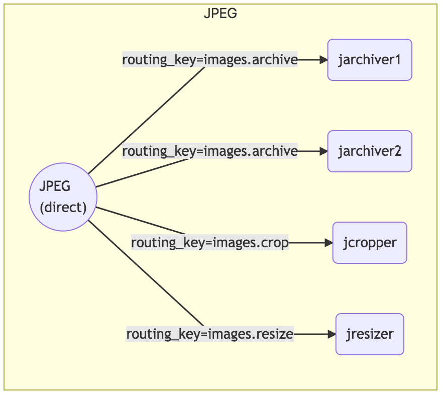

# rabbit-mermaid-cli [![NPM version][npm-image]][npm-url] [![Build Status][travis-image]][travis-url] [![Dependency Status][daviddm-image]][daviddm-url] [![Coverage percentage][coveralls-image]][coveralls-url]

> CLI to generate markdown graphs of your rabbitmq topology.

The cli for rabbit-mermaid :rabbit::fish:. It takes your rabbitmq topology files and turns them into
markdown compatible dependency graphs. Direct, fanout, and topic-based exchanges are supported.

## Installation

```sh
npm install -g rabbit-mermaid-cli
```

## Usage

definitions.json

```js
{
    exchanges: [
        {
            name: "images",
            vhost: "/",
            type: "direct",
            durable: true,
            auto_delete: false,
            internal: false,
            arguments: {}
        }
    ],
    queues: [
        {
            name: "archiver1",
            vhost: "/",
            durable: true,
            auto_delete: false,
            arguments: {}
        },
        {
            name: "archiver2",
            vhost: "/",
            durable: true,
            auto_delete: false,
            arguments: {}
        },
        {
            name: "cropper",
            vhost: "/",
            durable: true,
            auto_delete: false,
            arguments: {}
        },
        {
            name: "resizer",
            vhost: "/",
            durable: true,
            auto_delete: false,
            arguments: {}
        }
    ],
    bindings: [
        {
            source: "images",
            vhost: "/",
            destination: "archiver1",
            destination_type: "queue",
            routing_key: "images.archive",
            arguments: {}
        },
        {
            source: "images",
            vhost: "/",
            destination: "archiver2",
            destination_type: "queue",
            routing_key: "images.archive",
            arguments: {}
        },
        {
            source: "images",
            vhost: "/",
            destination: "cropper",
            destination_type: "queue",
            routing_key: "images.crop",
            arguments: {}
        },
        {
            source: "images",
            vhost: "/",
            destination: "resizer",
            destination_type: "queue",
            routing_key: "images.resize",
            arguments: {}
        }
    ]
}
```

```sh
rabdg -f ./definitions.json

graph LR
subgraph Images
Images(("Images<br/>(direct)"))
Images --routing_key=images.archive--> archiver1("archiver1")
Images --routing_key=images.archive--> archiver2("archiver2")
Images --routing_key=images.crop--> cropper("cropper")
Images --routing_key=images.resize--> resizer("resizer")
end
```

When put into a markdown file that supports [mermaid](https://mermaidjs.github.io/) will generate



# Options

## File

Specify the json file that contains the topology definitions. This is required.

| Default | CLI Override |
| ------- | ------------ |
| `None`  | `-f <file>`  |

## Exchanges

Specify the exclusive list of exchanges that you want in your output. All other exchanges will be ignored.

| Default | CLI Override   |
| ------- | -------------- |
| `ALL`   | `-e <ex1,ex2>` |

## Show exchange to exchange bindings

Whether or not to display exchange to exchange bindings in the generated output. This is disabled by default to reduce noise in large topologies with many dependencies.

| Default | CLI Override |
| ------- | ------------ |
| `false` | `-x`         |

## License

MIT © [David Salas]()

[npm-image]: https://badge.fury.io/js/rabbit-mermaid-cli.svg
[npm-url]: https://npmjs.org/package/rabbit-mermaid-cli
[travis-image]: https://travis-ci.org/davidlivingrooms/rabbit-mermaid-cli.svg?branch=master
[travis-url]: https://travis-ci.org/davidlivingrooms/rabbit-mermaid-cli
[daviddm-image]: https://david-dm.org/davidlivingrooms/rabbit-mermaid-cli.svg?theme=shields.io
[daviddm-url]: https://david-dm.org/davidlivingrooms/rabbit-mermaid-cli
[coveralls-image]: https://coveralls.io/repos/davidlivingrooms/rabbit-mermaid-cli/badge.svg
[coveralls-url]: https://coveralls.io/r/davidlivingrooms/rabbit-mermaid-cli
